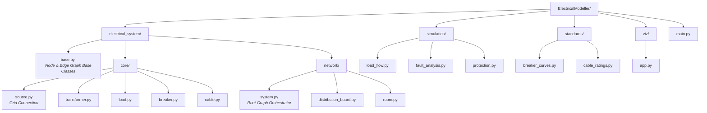

# Python Based Electrical System Modeling and Visualization Framework

## Overview
This project aims to develop a Python-based framework for modeling, simulating and visualizing electrical power systems using Dash and Plotly. 

It will allow Electrical design Engineers to accurately create drawings and designs that use the correct real world electrical engineering principles and standards and allow them to specify the correct components.

It will provide a platform for students and educators to explore electrical concepts in a safe and interactive environment.

The system is designed to scale from individual room-level electrical loads to a full residential low-voltage (LV) distribution network, enabling accurate simulation of:

- Load behaviour
- Overcurrent and short-circuit faults
- Protective device operation
- Cable sizing
- Phase balancing and system capacity
- Voltage drop

## Objectives

- **Electrical System Modeling**: Using realistic, standards-aligned abstractions
- **Simulation**: Simulate normal operation, overcurrent, and fault conditions
- **Compute**: fault currents based on transformer characteristics, cable size, distance, protective device characteristics
- **Evaluate**: Protection coordination and selectivity
- **Visualization**: Visualize electrical behaviour interactively
- **Educational Tools**: Provide educational resources and tools for learning about electrical concepts

Support incremental expansion from room → distribution board → building → transformer

## Scope

Included

- Room-level load modeling (lighting, sockets, appliances)
- Circuit breaker behavior (thermal and instantaneous)
- Cable impedance and voltage drop
- Single-phase and three-phase systems
- Fault current calculation (prospective short-circuit current)
- Interactive dashboards (Dash/Plotly)

Excluded (Initial Phase)

- Harmonic analysis
- Transient simulation
- Arc-flash energy modeling
- Utility-side protection and HV systems

## System Architecture

The framework is divided into logical layers, ensuring scalability and maintainability.



## Conceptual Model

### Electrical Primitives
- Loads 
    - Represent end devices with rated power, power factor, phase assignment, and optional fault impedance.
- Circuit Breakers 
    - Include rated current and trip behavior (thermal overload and instantaneous short-circuit response).
- Cables 
    - Modeled via resistance and reactance per unit length, allowing accurate loop impedance calculation.
- Transformers / Sources
    - Defined by secondary voltage and short-circuit capacity.

### Network Topology

Electrical systems are modeled as connected networks:

- Rooms are supplied by local circuit breakers
- Rooms connect to distribution boards
- Distribution boards are fed from a three-phase source
- Cables define both connectivity and electrical impedance
This enables fault and load calculations based on electrical distance, not just component ratings.

### Simulation Capabilities

- Load Analysis
    - Total current per circuit
    - Phase loading and imbalance
    - Neutral current estimation (multi-phase scenarios)
- Fault Analysis
    - Line-to-neutral and line-to-line faults
    - Prospective fault current calculation
    - Fault loop impedance evaluation
- Protection Logic
    - Overcurrent detection
    - Instantaneous trip checks
    - Selectivity assessment between upstream and downstream breakers
- Cable Sizing Validation
    - Thermal current limits
    - Fault clearance feasibility
    - Voltage drop under load
- Visualization & User Interface
    - Th    e Dash-based interface will provide:
        - Interactive single-line diagrams (logical)
        - Load and fault current bar charts
        - Phase utilization dashboards
        - Visual indicators for:
            - Overloaded circuits
            - Undersized cables
            - Protection miscoordination
All calculations are performed outside Dash callbacks, with the UI strictly consuming simulation output.

### Intended Outcome

Upon completion, the framework will allow:

-   Accurate calculation of fault currents based on real cable lengths
- Proper sizing of circuit breakers and protective devices
- Verification of instantaneous fault clearance
- Phase balancing across a residential installation
- Design validation before construction
- Visual communication of electrical design decisions

### Target Users

- Electrical engineers
- Electrical design consultants
- Engineering students
- Technical tool developers
- Power system simulation enthusiasts

### Future Enhancements

- IEC / NEC selectable standards
- Time–current characteristic curves
- Automated cable & breaker selection
- PDF design reports
Arc-fault and earth-leakage modeling
Light commercial building support
Guiding Principles
Engineering ac  curacy before UI polish
Modular and testable design
Standards-aware modeling
Visualization as insight, not decoration

### Installation

```bash
# Clone the repository
git clone https://github.com/turynlimbanda/ElectricalModeller.git

# Navigate to the project directory
cd ElectricalModeller

# Install dependencies
pip install -r requirements.txt
```
### Contributing

Contributions are welcome! Please feel free to submit a Pull Request.